<div align="center">

# Udiksa

**A calm, retro-hardware Arch Linux rice: Hyprland, a hand-made Quickshell shell, and 22 themes that recolour everything.**

[](https://archlinux.org)
[](https://hypr.land)
[](https://quickshell.org)
[](LICENSE)

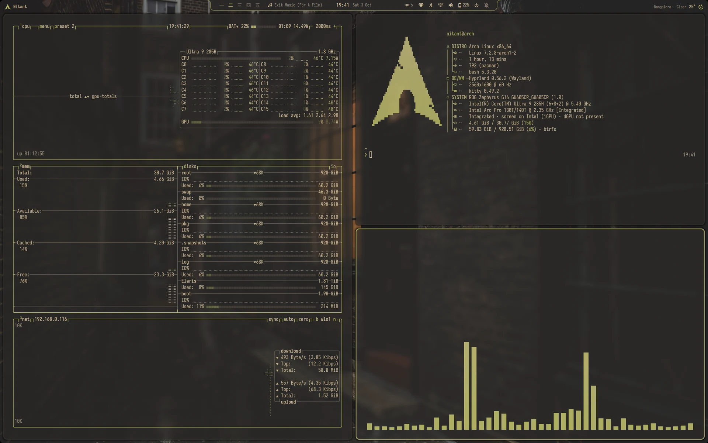

[Features](#features) · [Themes](#22-themes-one-key) · [Shell](#the-notch) · [Settings](#settings) · [Install](#install) · [Keys](#keys) · [Credits](#credits)

</div>

---

## Features

- **The notch**: a slim bar at the top of the screen that opens into panels: launcher, system, sound, calendar, media,
  battery, Wi-Fi, Bluetooth, notifications. Volume, brightness and keyboard-light changes show inside it.
- **22 themes, one key**: <kbd>Super</kbd>+<kbd>T</kbd> switches theme and wallpaper. Everything follows: window
  borders, the shell, the terminal, GTK and Qt apps, btop, fastfetch, ncspot, cava, the login screen, even GRUB.
- **A real Settings app** (<kbd>Super</kbd>+<kbd>I</kbd>): tiling layout, gaps, shadows, displays (resolution, scale,
  rotation, several monitors), sound, keyboard, Wi-Fi, Bluetooth, battery and sleep, hibernation, apps, and more.
- **Your own layer**: whatever you change in Settings lives in `~/.config/hypr/local/`, apart from the design, so
  updating the rice never overwrites your choices.
- **Adapts to the machine**: screens, GPU, battery, Bluetooth and boot loader are detected, and the notch and
  Settings show only what works here. ASUS laptops and hybrid NVIDIA laptops get extra support, offered only where it
  fits. Other devices: see [Hardware support](docs/HARDWARE.md) to add your own.
- **Batteries included**: login screen, lock screen, boot splash, hibernation, btrfs snapshots, mirror refresh and
  cleanup scripts, a clipboard history, an emoji picker and a calculator in the launcher.
- **Tools**: screen recording (GPU-encoded, with or without sound), a colour picker, screenshots you can draw on,
  keep awake, game mode, a usage panel (CPU per core, memory, network, disks, busiest programs), weather in the
  calendar, low-battery warnings and short status messages in the notch.
- **App scratchpads**: btop, your music app and your chat app each on their own key, shown over whatever you do.
- **A mouse pointer in the theme's colour** (Bibata's pointy shape) that grows when you shake it to find it.

## 22 themes, one key

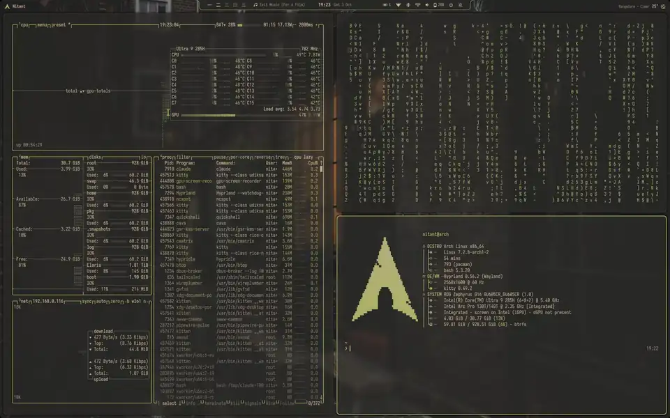

Each theme is a folder of wallpapers with a colour file. Every wallpaper tints the palette a little, so no two feel the
same. Add your own: make a folder in `~/Pictures/Wallpapers`, drop pictures in, and the colours are made from them.

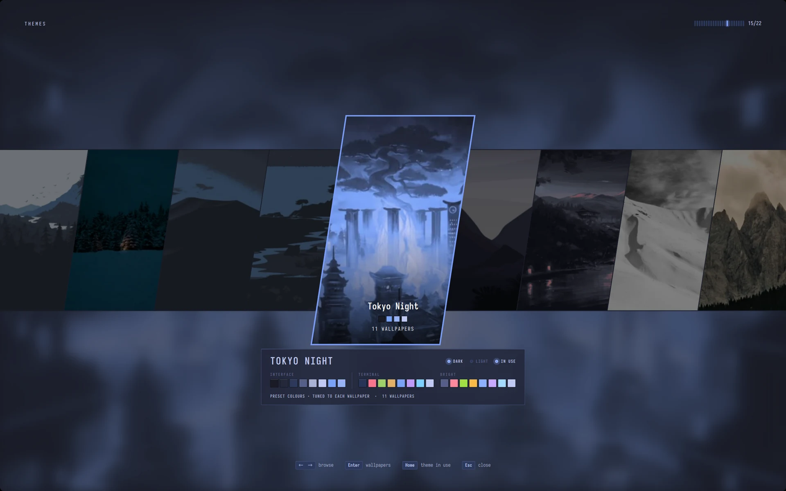

<details>
<summary><b>All themes</b></summary>

<br>

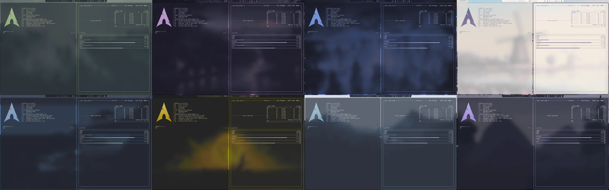

Catppuccin Latte · Catppuccin Mocha · Dracula · Everforest Dark · Everforest Light · Graphite · Gruvbox Dark ·
Gruvbox Light · Gruvbox Material · Kanagawa · Kanagawa Dragon · Monokai Pro · Nord · One Dark · Rosé Pine ·
Rosé Pine Dawn · Solarized Dark · Terafox · Tokyo Night · Vantablack · White · Zenburn

</details>

## The notch

| Launcher (<kbd>Super</kbd>+<kbd>R</kbd>) | System |
|:---:|:---:|
| 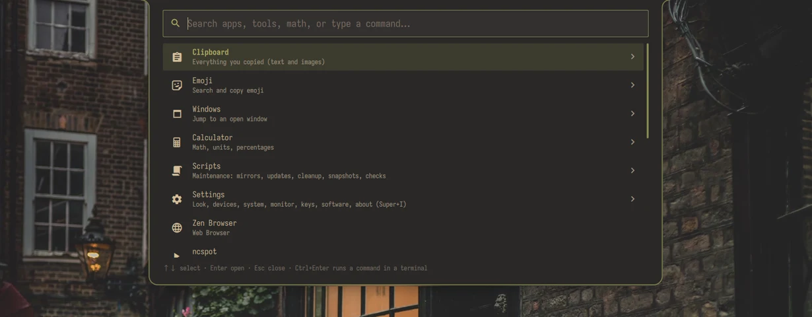 | 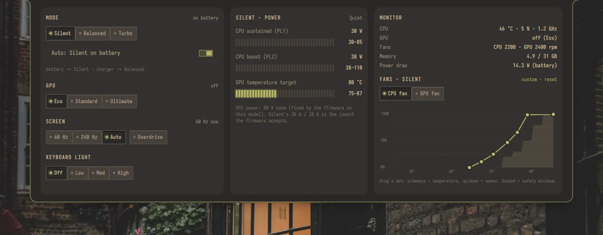 |
| Apps, clipboard, emoji, calculator, windows, maintenance scripts | Performance mode, GPU, refresh rate, keyboard light, fans |

| Calendar | Sound |
|:---:|:---:|
| 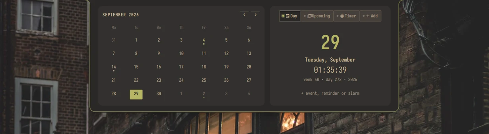 | 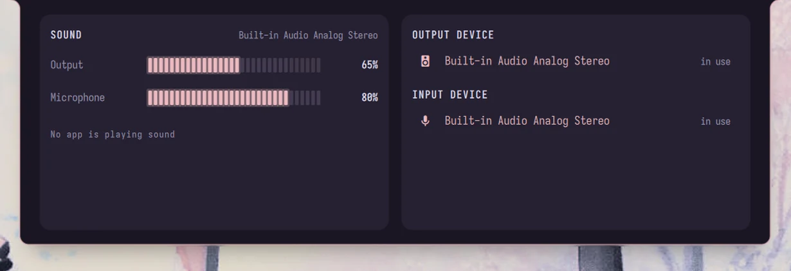 |

| Media | Battery |
|:---:|:---:|
| 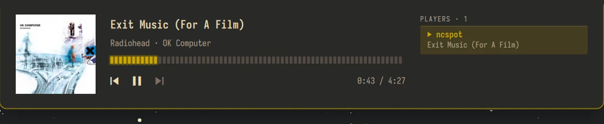 | 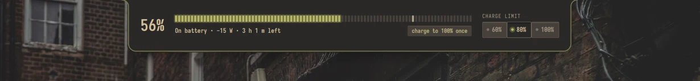 |

## Settings

A full settings app in the same style as the rest: every change applies live.

| Windows and tiling | Display |
|:---:|:---:|
| 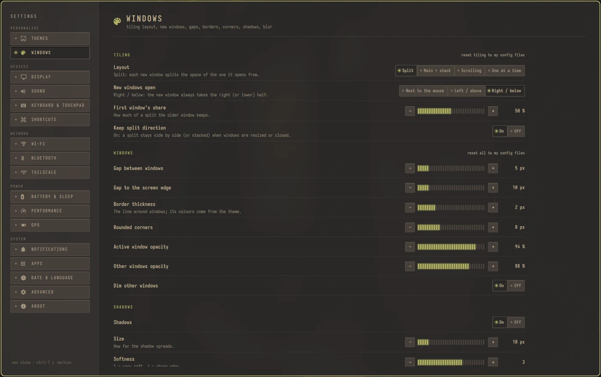 | 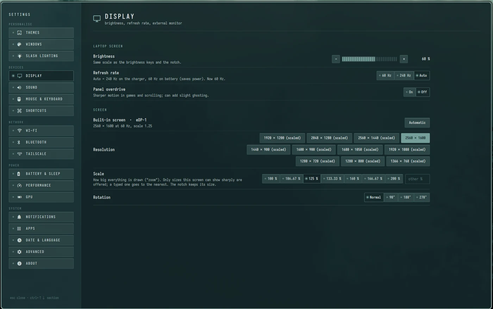 |

| Battery and sleep | Themes and colours |
|:---:|:---:|
| 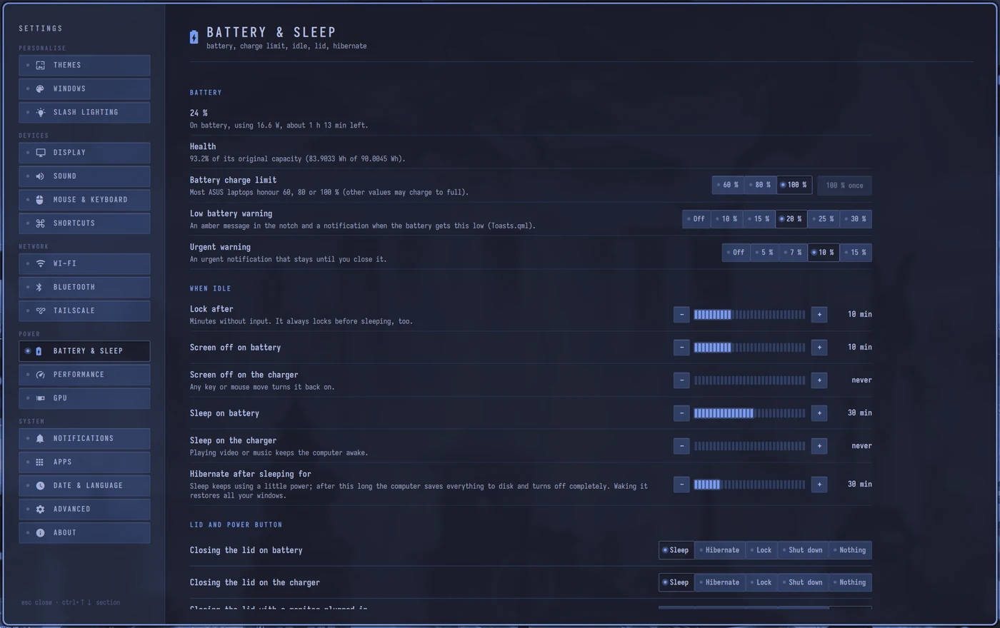 | 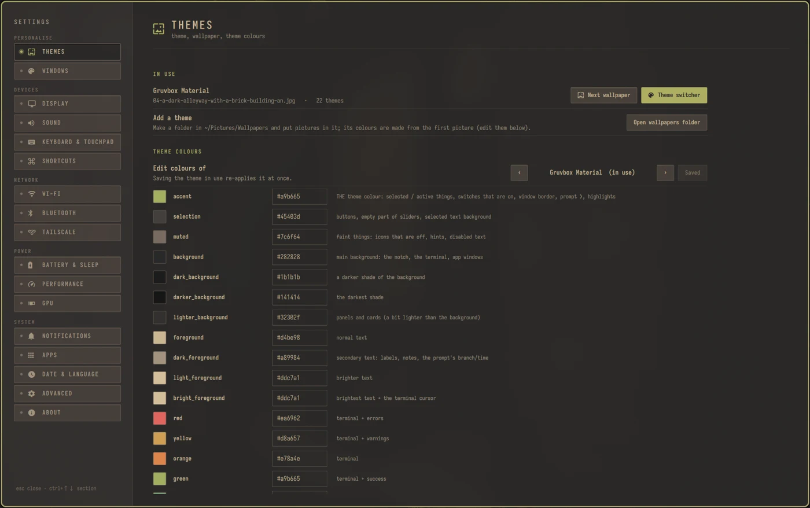 |

<details>
<summary><b>More pages</b></summary>

<br>

| Keyboard and touchpad | Apps |
|:---:|:---:|
| 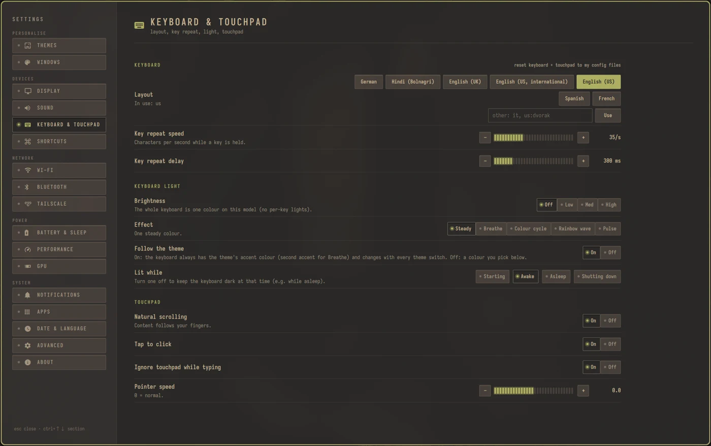 | 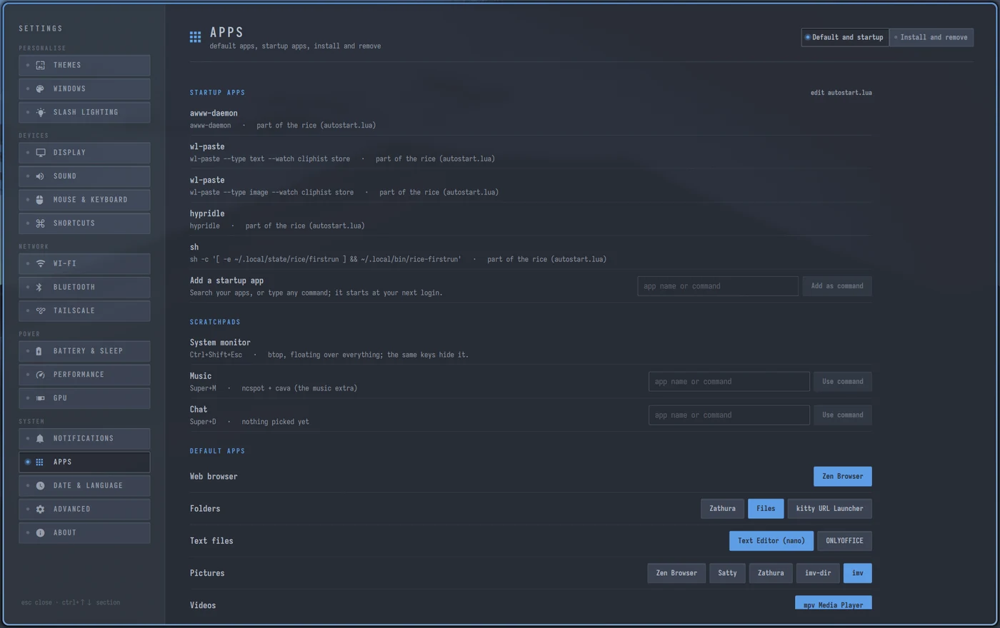 |

| Performance (ASUS) | GPU (hybrid NVIDIA) |
|:---:|:---:|
| 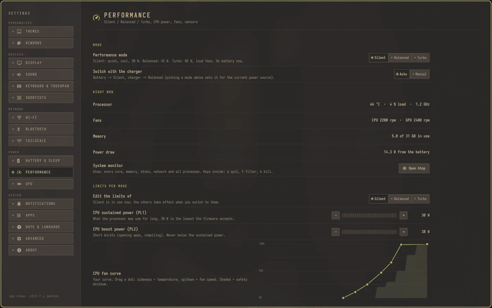 | 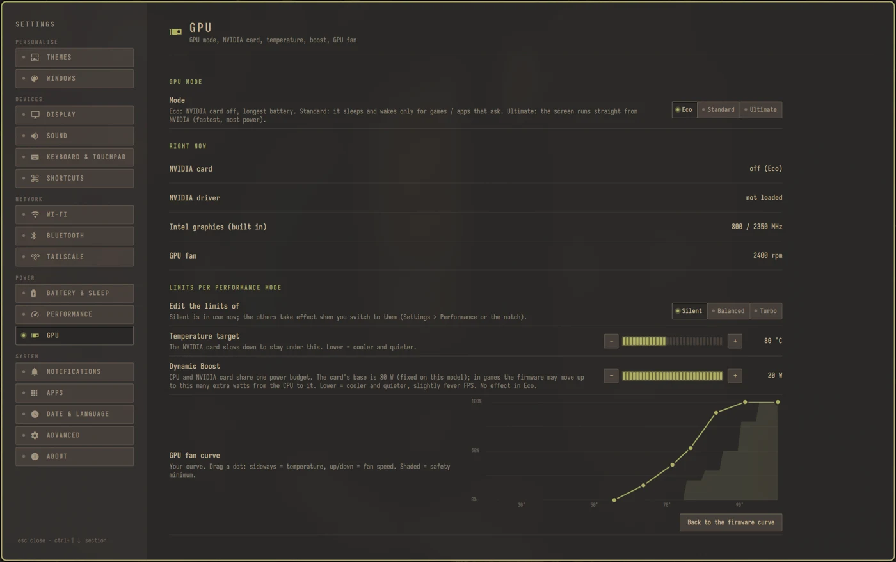 |

</details>

## Music

ncspot (Spotify in the terminal) with a cava visualiser, floating on the scratchpad, themed like everything else.

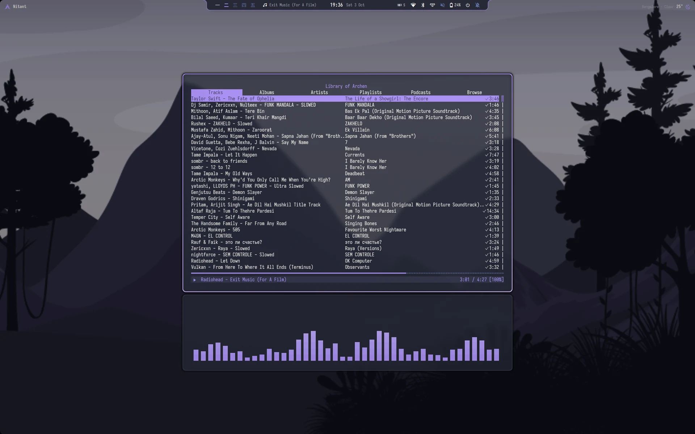

## Install

> [!WARNING]
> Udiksa changes your desktop, login screen and boot splash. Try it in a VM first, or on a fresh install.

**On any installed Arch** (archinstall or your own setup), logged in as your user and online:

```sh
sudo pacman -S --needed git
git clone https://github.com/arcje-acrh/Udiksa ~/Udiksa
cd ~/Udiksa && ./install.sh 2 3
```

- **Part 2, apps**: the core apps, then asks about each optional one (Zen Browser, OnlyOffice, ncspot, Tailscale).
- **Part 3, the rice**: links the configs, installs the login screen, boot splash and GRUB theme (if you use GRUB),
  and sets up hibernation (uses your swap, or makes a swap file).
- **Hardware**: on an ASUS laptop or a hybrid NVIDIA laptop, it offers the matching support (see `hardware/`).
  Something on your machine not supported? [docs/HARDWARE.md](docs/HARDWARE.md) shows how to add it.
- **Reboot.** The first login sets the theme, desktop settings and default apps.

**On a blank machine**: boot the Arch USB, clone the repo there, and run `./install.sh 1` first. It installs Arch on
the disk you pick (btrfs with snapshots, a swap file for hibernation, GRUB), never on a disk with Windows on it.
`--dry-run` shows every step first. Then reboot and run `./install.sh 2 3`.

Afterwards: Wi-Fi passwords, signing in to your apps, and `sudo tailscale up` if you chose Tailscale.

## Keys

| Keys | Action |
|---|---|
| <kbd>Super</kbd>+<kbd>Enter</kbd> | Terminal (kitty) |
| <kbd>Super</kbd>+<kbd>R</kbd> | Launcher |
| <kbd>Super</kbd>+<kbd>I</kbd> | Settings |
| <kbd>Super</kbd>+<kbd>T</kbd> / <kbd>Super</kbd>+<kbd>Shift</kbd>+<kbd>T</kbd> | Theme switcher / next wallpaper |
| <kbd>Super</kbd>+<kbd>E</kbd> | Files |
| <kbd>Super</kbd>+<kbd>Q</kbd> | Close window |
| <kbd>Super</kbd>+<kbd>V</kbd> / <kbd>Super</kbd>+<kbd>F</kbd> | Float / fullscreen |
| <kbd>Super</kbd>+<kbd>Arrows</kbd> | Move focus |
| <kbd>Super</kbd>+<kbd>Shift</kbd>+<kbd>Arrows</kbd> | Move window |
| <kbd>Super</kbd>+<kbd>H</kbd> <kbd>J</kbd> <kbd>K</kbd> <kbd>L</kbd> | Resize window |
| <kbd>Super</kbd>+<kbd>1</kbd>…<kbd>0</kbd> / <kbd>Super</kbd>+<kbd>Shift</kbd>+<kbd>1</kbd>…<kbd>0</kbd> | Go to / move to workspace |
| <kbd>Super</kbd>+<kbd>S</kbd> / <kbd>Super</kbd>+<kbd>Shift</kbd>+<kbd>S</kbd> | Show scratchpad / send window there |
| <kbd>Super</kbd>+<kbd>P</kbd> | Screens: extend, mirror, only one |
| <kbd>Print</kbd> / <kbd>Shift</kbd>+<kbd>Print</kbd> / <kbd>Ctrl</kbd>+<kbd>Print</kbd> | Screenshot: area / window / screen |
| <kbd>Alt</kbd>+<kbd>Print</kbd> | Screenshot to draw on (arrows, text, blur) |
| <kbd>Super</kbd>+<kbd>Alt</kbd>+<kbd>R</kbd> (+<kbd>Shift</kbd> area, +<kbd>Ctrl</kbd> with sound) | Record the screen; again = stop |
| <kbd>Super</kbd>+<kbd>Shift</kbd>+<kbd>C</kbd> | Colour picker |
| <kbd>Super</kbd>+<kbd>Shift</kbd>+<kbd>P</kbd> / <kbd>Super</kbd>+<kbd>Alt</kbd>+<kbd>\\</kbd> / <kbd>Super</kbd>+<kbd>C</kbd> | Pin window / picture-in-picture / centre |
| <kbd>Super</kbd>+<kbd>G</kbd>, <kbd>Super</kbd>+<kbd>Tab</kbd> | Window group (tabs), next tab |
| <kbd>Super</kbd>+<kbd>PgUp</kbd> / <kbd>PgDn</kbd> | Previous / next workspace |
| <kbd>Ctrl</kbd>+<kbd>Shift</kbd>+<kbd>Esc</kbd> / <kbd>Super</kbd>+<kbd>M</kbd> / <kbd>Super</kbd>+<kbd>D</kbd> | System monitor / music / chat scratchpad |

Every binding is listed, and your own can be added, in Settings > Shortcuts.

## How it's built

| Folder | What |
|---|---|
| `install.sh` | runs the parts: `1` Arch (optional), `2` apps, `3` the rice |
| `1-arch/` | the optional base installer for a blank disk |
| `2-packages/` | core app lists (`repo.txt`, `aur.txt`), GPU driver lists, the installer |
| `3-rice/home/` | the design, linked into your home with GNU Stow: `config/` → `~/.config`, `bin/` → `~/.local/bin`, `wallpapers/` → `~/Pictures/Wallpapers`, … |
| `3-rice/optional/` | optional apps with their theming, linked only when installed |
| `3-rice/system/` | login screen, boot splash, hibernation and snapshot setup |
| `hardware/` | ASUS laptops (`asus/`) and hybrid NVIDIA laptops (`nvidia/`): detected, then offered |

**The rule: design ships, personal choices stay.** The repo holds the look, the shell, the themes, the key binds and
the scripts. Your screens, timers, layout choices and your own shortcuts live in `~/.config/hypr/local/`, which git
ignores and Hyprland loads last. Configs are symlinks into `~/Udiksa`, so `git pull` updates your desktop, and editing
a config at its usual path edits the repo.

Command-line tools that come with it: `rice-theme` (themes), `rice-settings` (Settings' back end), `display-mode`,
`rice-idle`, `rice-defaults`, plus maintenance scripts (update, mirrors, orphans, cache, snapshots) in the launcher.

## Credits

Udiksa stands on a lot of other people's work. Thank you all.

**Built on**
- [Arch Linux](https://archlinux.org), [Hyprland](https://hypr.land), [Quickshell](https://quickshell.org)
  (the whole shell: notch, panels, Settings, lock screen), [greetd](https://git.sr.ht/~kennylevinsen/greetd) +
  [cage](https://www.hjdskes.nl/projects/cage/) (login screen), [Plymouth](https://www.freedesktop.org/wiki/Software/Plymouth/) (boot splash)

**Parts taken or adapted from other projects**
- Login / lock screen layout: the "sword" theme of [qylock](https://github.com/Darkkal44/qylock) by Darkkal44 (GPL-3.0)
- Mouse pointer: [Bibata](https://github.com/ful1e5/Bibata_Cursor) by Abdulkaiz Khatri (GPL-3.0); its Original
  drawings are in `3-rice/assets/bibata-original`, recoloured with each theme
- fastfetch layout: [JaKooLit's Hyprland-Dots](https://github.com/JaKooLit/Hyprland-Dots)
- Ideas for the tools (screen recording, colour picker, status messages, keep awake / game mode, usage panel,
  scratchpads, weather): the [Caelestia](https://github.com/caelestia-dots/shell) shell

**Tools and plugins the rice uses**
- Theming: [matugen](https://github.com/InioX/matugen) (colours from wallpapers), [awww](https://codeberg.org/LGFae/awww)
  (wallpapers), [adw-gtk3](https://github.com/lassekongo83/adw-gtk3), [Kvantum](https://github.com/tsujan/Kvantum),
  [Iosevka](https://github.com/be5invis/Iosevka) + [Nerd Fonts](https://github.com/ryanoasis/nerd-fonts)
- Shake to find: [hypr-dynamic-cursors](https://github.com/VirtCode/hypr-dynamic-cursors) by VirtCode
- Capture: [hyprshot](https://github.com/Gustash/Hyprshot), [Satty](https://github.com/Satty-org/Satty),
  [hyprpicker](https://github.com/hyprwm/hyprpicker), [gpu-screen-recorder](https://git.dec05eba.com/gpu-screen-recorder)
- Terminal and apps: [kitty](https://sw.kovidgoyal.net/kitty/), [starship](https://starship.rs),
  [ble.sh](https://github.com/akinomyoga/ble.sh), [fastfetch](https://github.com/fastfetch-cli/fastfetch),
  [btop](https://github.com/aristocratos/btop), [ncspot](https://github.com/hrkfdn/ncspot),
  [cava](https://github.com/karlstav/cava), [cliphist](https://github.com/sentriz/cliphist),
  [libqalculate](https://github.com/Qalculate/libqalculate) (launcher calculator)
- ASUS laptops: [asusctl / supergfxctl](https://gitlab.com/asus-linux)

**Data**
- Weather: [Open-Meteo](https://open-meteo.com) (forecast + place search, no account)
- Holidays in the calendar: Google's public holiday calendar

**Palettes and pictures**
- Theme palettes by their authors: Catppuccin, Dracula, Everforest, Gruvbox, Gruvbox Material, Kanagawa, Monokai Pro,
  Nord, One Dark, Rosé Pine, Solarized, Nightfox (Terafox), Tokyo Night, Zenburn
- Wallpapers by their artists: every theme folder has a `SOURCES.txt` with the link and licence of each picture

## License

The code and configs are [MIT](LICENSE), except two parts under GPL-3.0 from the projects above: the Bibata pointer
drawings (`3-rice/assets/bibata-original`, licence included there) and the login / lock screen layout adapted from
qylock (`3-rice/home/config/quickshell/login/LoginScreen.qml`). Wallpapers and theme palettes keep their own licences
(see `SOURCES.txt` in each theme folder).
